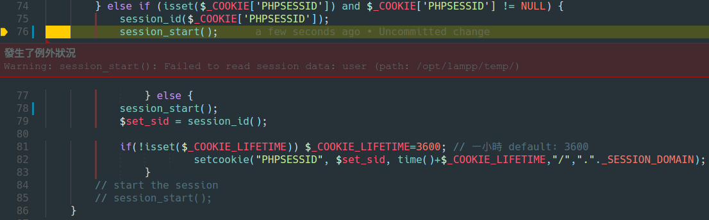

目錄
* toc
{:toc}

---

其實這問題碰到一陣子了，從我還不會用 xdebug 就碰到了，

用 xdebug 前的情況是我進後台的登入頁

打完帳號密碼點登入完全沒反應，只會繼續跳轉回登入頁

沒有彈出任何錯息

用了 xdebug 後就乖乖的彈出警告訊息啦



> Warning: session_start(): Failed to read session data: user

再根據錯誤訊息來 google 很快就找到解法了

是因為 SessionHandler 的 read 找不到值沒有回傳 null 導致的問題

改之前

```php
<?php
/**
 * read
 */
function _read($session_id) {
    $sql = "SELECT sessdata FROM sessions
            WHERE sesskey = '" . $session_id . "'
              AND expiry  > '" . date("Y-m-d H:i:s", time() ) . "'
            LIMIT 1";
    $iRs = mysqli_query($this->_link, $sql);
    $fields = mysqli_fetch_assoc($iRs);

    return $fields['sessdata'];
}
?>
```

改好後

```php
<?php
/**
 * read
 */
function _read($session_id) {
    $sql = "SELECT sessdata FROM sessions
            WHERE sesskey = '" . $session_id . "'
              AND expiry  > '" . date("Y-m-d H:i:s", time() ) . "'
            LIMIT 1";
    $iRs = mysqli_query($this->_link, $sql);
    return empty($fields = mysqli_fetch_assoc($iRs)) ? null : $fields['sessdata'];
}
?>
```

---

reference :

* [session-set-save-handler.php#118225](http://php.net/manual/en/function.session-set-save-handler.php#118225)

* [php5.6からphp7.1にあげたら Failed to read session data: user (path: /var/lib/php/session) と怒られた](http://qiita.com/ara_ta3/items/504f37bb9932af6d2cc3)
