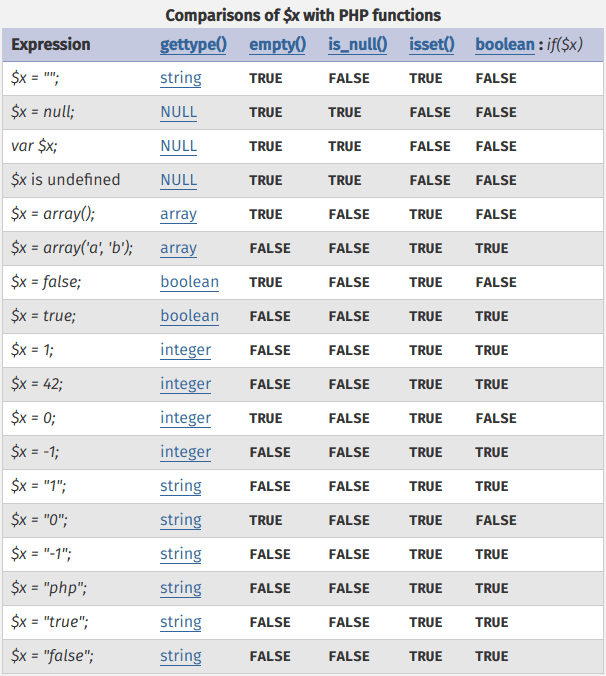
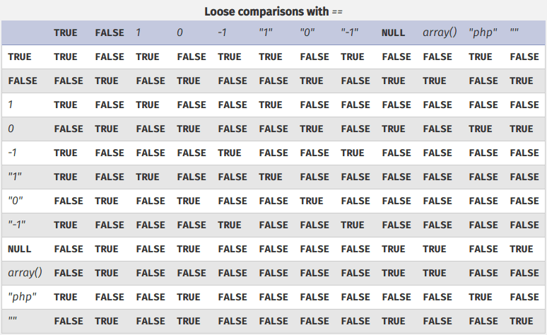

目錄
* toc
{:toc}

---

## Array

### 清除陣列字串頭尾的多餘空白

`$test = array_map('trim', $test);`

### 清除陣列空值

`array_values(array_filter($aArray));`

---

### 清除陣列重複值

使用 array_flip 和 array_keys 會比 array_unique 來的快速

array_keys 會重新排序 index

array_flip 則不會重新排序 index

#### 範例

```php
$test = Array(8, 9, 10, 11, 10, 11, 8, 9);
print_r($test);
// 使用前的陣列
Array
(
    [0] => 8
    [1] => 9
    [2] => 10
    [3] => 11
    [4] => 10
    [5] => 11
    [6] => 8
    [7] => 9
)

$test = array_keys(array_flip($test));
print_r($test);
// 使用後的陣列
Array
(
    [0] => 8
    [1] => 9
    [2] => 10
    [3] => 11
)

$test = array_flip(array_flip($test));
print_r($test);
// 使用後的陣列
Array
(
    [6] => 8
    [7] => 9
    [4] => 10
    [5] => 11
)
```

#### 實做

經過測試在 PHP >= 7.0 的環境下
比較 4 種刪除重複值的方式速度如下
array_flip = array_values = array_keys > array_unique
而且前 3 者遠快於 array_unique

```php
class testClass
{
    public static function ArrayUnique()
    {
        $test = array();
        for ($run = 0; $run < 1000; $run++) {
            $test[] = rand(0,100);
        }

        $time = microtime(true);

        for ($run = 0; $run < 100; $run++) {
            $out = array_unique($test);
        }

        $time = microtime(true) - $time;
        echo 'Array Unique: ' . $time . "\n";
    }

    public static function KeysFlip()
    {
        $test = array();
        for ($run = 0; $run < 1000; $run++) {
            $test[] = rand(0,100);
        }

        $time = microtime(true);

        for ($run = 0; $run < 100; $run++) {
            $out = array_keys(array_flip($test));
        }

        $time = microtime(true) - $time;
        echo 'Keys Flip:    ' . $time . "\n";
    }

    public static function FlipFlip()
    {
        $test = array();
        for ($run = 0; $run < 1000; $run++) {
            $test[] = rand(0,100);
        }

        $time = microtime(true);

        for ($run = 0; $run < 100; $run++) {
            $out = array_flip(array_flip($test));
        }

        $time = microtime(true) - $time;
        echo 'Flip Flip:    ' . $time . "\n";
    }

    public static function main()
    {
        self::ArrayUnique(); // Keys Flip:    0.0010750293731689
        self::KeysFlip();    // Keys Flip:    0.0010750293731689
        self::FlipFlip();    // Flip Flip:    0.0010089874267578
    }

}
testClass::main();
```

reference :

* [[PHP] 將陣列中重複的值刪除最好方法 array_flip (移除陣列中重複的值)](https://iris-dog-cat.blogspot.tw/2014/12/php-arrayflip.html)

---

### 排序2維陣列

vArrayOrderBy允許多重排序

```php
function vArrayOrderBy()
{
    $args = func_get_args();
    $data = array_shift($args);
    foreach ($args as $n => $field) {
        if (is_string($field)) {
            $tmp = array();
            foreach ($data as $key => $row) {
                $tmp[$key] = $row[$field];
            }
            $args[$n] = $tmp;
        }
    }
    $args[] = &$data;
    call_user_func_array('array_multisort', $args);
    return array_pop($args);
}

// The sorted array is now in the return value of the function
// instead of being passed by reference.

$data[] = array('volume' => 67, 'edition' => 2);
$data[] = array('volume' => 86, 'edition' => 1);
$data[] = array('volume' => 85, 'edition' => 6);
$data[] = array('volume' => 98, 'edition' => 2);
$data[] = array('volume' => 86, 'edition' => 6);
$data[] = array('volume' => 67, 'edition' => 7);

// Pass the array, followed by the column names and sort flags
$sorted = vArrayOrderBy($data, 'volume', SORT_DESC, 'edition', SORT_ASC);
print_r($sorted);
```

---

### 合併2維陣列

```php
/**
 * Merge 2D Array, use 2 foreach is non efficient,
 * but this way can merge multi row
 *
 * @param array $aArr1 must be 2D array
 * @param array $aArr2 must be 2D array
 * @param string $sKey comparison condition, both array has this key
 * @return array
 */
function a2DArrayMerge($aArr1 = array(), $aArr2 = array(), $sKey = '')
{
    $resultArr = array();
    foreach ($aArr1 as $bemerge) {
        $sKeyVal = $bemerge[$sKey];
        foreach ($aArr2 as $search) {
            if ($search[$sKey] == $sKeyVal) {
                $resultArr[] = array_merge($search,$bemerge);
                break;
            }
        }
    }
    return $resultArr;
}

/**
 * Merge 2D Array, use 1 foreach is more efficient,
 * but this way can only merge 1 row
 *
 * @param array $aArr1 must be 2D array base array
 * @param array $aArr2 must be 2D array add array
 * @param string $sAddKey  you want to add's $aArr2 key
 * @param string $sMainKey comparison condition, both array has this key
 * @return array
 */
public function aArrayMergeByMainKey($aArr1, $aArr2, $sAddKey, $sMainKey)
{
    $aIndexValue = array_column($aArr2, "$sAddKey", "$sMainKey");
    foreach($aArr1 as $key => $item) {
        $exist = array_key_exists($item["$sMainKey"], $aIndexValue);
        $aArr1[$key]["$sAddKey"] = $exist ? $aIndexValue[$item["$sMainKey"]] : '';
    }
    return $aArr1;
}
/**
 * Merge 2D Array, use 1 foreach and recursiveis is more elegant,
 * this way dose'n need any key,
 * it will directly replace repeat key. not fit in this case
 *
 * @param array $aArr1 must be 2D array
 * @param array $aArr2 must be 2D array
 * @return array
 */
public function aArrayMergeRecursive(&$aArr1, &$aArr2)
{
    $aMerged = $aArr1;
    foreach ($aArr2 as $key => &$value) {
        if (is_array($value) &&
            isset($aMerged[$key]) &&
            is_array($aMerged[$key])) {
                $aMerged[$key] = self::aArrayMergeRecursive($aMerged[$key], $value);
        } else {
            $aMerged[$key] = $value;
        }
    }
    return $aMerged;
}
```

---

### 排序陣列usort
#### Spaceship Operator

PHP7 spaceship operator very helpful in sorting function callback

```php
// Just wanted to show off the beauty of PHPs spaceship operator in this use case.
// tested on PHP 7.1
$a = [2, 1, 3, 6, 5, 4, 7];
$asc = $desc = $a;
usort($asc, function (int $a, int $b) { return ($a <=> $b); });
usort($desc, function (int $a, int $b) { return -($a <=> $b); });
print_r([ $a, $asc, $desc ]);

/**
 * Usort with PHP7 Spaceship vs PHP5.6
 *
 */
// PHP 7 with spaceship operator
usort($array, function(int $a, int $b) {
  return $a <=> $b;
});

// PHP 5.6
usort($array, function(int $a, int $b) {
  if ($a == $b) {
    return 0;
  }
  return ($a < $b) ? -1 : 1;
});
```

結果如下

```php
Array
(
    [0] => Array
        (
            [0] => 2
            [1] => 1
            [2] => 3
            [3] => 6
            [4] => 5
            [5] => 4
            [6] => 7
        )

    [1] => Array
        (
            [0] => 1
            [1] => 2
            [2] => 3
            [3] => 4
            [4] => 5
            [5] => 6
            [6] => 7
        )

    [2] => Array
        (
            [0] => 7
            [1] => 6
            [2] => 5
            [3] => 4
            [4] => 3
            [5] => 2
            [6] => 1
        )

)
```

reference :

* [PHP: usort - Manual](https://secure.php.net/manual/en/function.usort.php#120344)

---

## Security

### Password Hash & Salt
The right way to hash passwords in PHP

require : PHP version >= 5.5

```php
$hash = password_hash("secretcode", PASSWORD_DEFAULT);

echo $sPasswordVerify = password_verify('secretcode', $hash) ? 'Password is valid!' : 'Invalid password.';
```

reference :

* [securepasswords.info - php](https://securepasswords.info/php)

---


## Comparisons

### Comparisons of $x with PHP functions


if ($x) 和 empty($x) 是一組

isset($x) 和 isnull($x) 是一組

### Loose comparisons with ==


### Strict comparisons with ===


reference :

* [PHP: usort - Manual](https://secure.php.net/manual/en/types.comparisons.php)

---

## Control Structures

### Break / Continue

Break / Continue 可以結束當下的 for/foreach/while/do while/**switch** 迴圈

要注意的是，不同於其他語言，對 PHP 來說，Switch 是可以使用 Continue 做跳出的一種迴圈結構

> Break / Continue 後面可以接數字參數來決定要跳過第幾層迴圈。

#### 範例

如果想要在迴圈中的 Switch 中跳出到下一層迴圈的話，

使用 Continue 的話是無法跳出迴圈的，要使用 Continue 2 ，

如果要再多一層迴圈要跳出的話就是 Continue 3。 依此類推

```php
$aNumbers = range(1, 10);
$aLetters = array('a', 'b', 'c', 'd', 'e', 'f', 'g', 'h', 'i');

$i = 0;
foreach ($aLetters as $sLetter) {
    ++$i;
    echo $sLetter . PHP_EOL;
    foreach ($aNumbers as $iNumber) {
        ++$i;
        switch ($sLetter) {
            case 'd':
                // So here I want to 'break;' out of the switch, 'break;'
                // out of the $aNumbers loop,
                // and then 'continue;' in the $aLetters loop.
                // go to the end of this switch, numbers loop iteration,
                // letters loop iteration
                continue 3;
                break;
            case 'f':
                // skip to the end of the switch control AND
                // the current iteration of the number's loop,
                // but still process the letter's loop
                continue 2;
                break;
            case 'h':
                // would be more appropriate to break the number's loop
                break 2;
        }
        // Still in the number's loop
        echo " $iNumber ";
    }
    // Stuff that should be done if the 'letter' is not 'd'.
    echo " $i " . PHP_EOL;
}
```

>回傳結果

```php
a
 1  2  3  4  5  6  7  8  9  10  11
b
 1  2  3  4  5  6  7  8  9  10  22
c
 1  2  3  4  5  6  7  8  9  10  33
d
e
 1  2  3  4  5  6  7  8  9  10  46
f
 57
g
 1  2  3  4  5  6  7  8  9  10  68
h
 70
i
 1  2  3  4  5  6  7  8  9  10  81
```


reference :

* [PHP: continue - Manual](https://secure.php.net/manual/en/control-structures.continue.php)
* [Generate array of random unique numbers in PHP - Stack Overflow](https://stackoverflow.com/questions/10824770/generate-array-of-random-unique-numbers-in-php)


---
