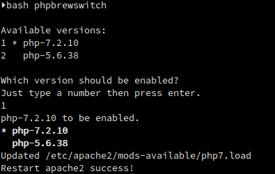

目錄
* toc
{:toc}

---

因為公司測試機上使用的 PHP 版本是 5.4.x

我的開發環境是的用 7.X 版

有時候一個不小心就會用到舊版不支援的 function

為了在 debug 時能夠可以重現測試機的錯誤

並且盡可能避免掉一些環境問題導致的錯誤

所以就打算在本機上部屬多個版本的 PHP

在網路上找了很多方法，最後決定使用現代一點的工具來做這件事

[c9s](https://github.com/c9s) 大大所開發的 [PHPBrew](https://github.com/phpbrew/phpbrew) 來解決多版本的問題

PHPBrew 除了可以安裝多個版本的 PHP ，並且做切換之外

還可以讓 PHP 開發者們像 Node.js / Python 開發者一樣

使用簡單的指令 `npm / pip` 來安裝需要的套件

看是要裝 xdebug 還是 composer 都只需要一行指令就搞定

再也不需要在看手冊要怎麼裝啦

也避免碰到一些[預料外的狀況要排除](https://watain666.github.io/Ubuntu-16.04-installing-Xdebug-for-PHP7/)

不過後來用了才發現 PHPBrew 的坑更大XDD

但確實是方便好用

要當個現代的 PHPer 說什麼也要把問題解決才行啊！

---

### 安裝

>測試環境
>
>OS：Ubuntu 18.04 LTS
>
>PHP︰7.2

找到最穩定的安裝方法是使用這個安裝腳本

<script src="https://gist.github.com/watain666/85f6efa58c28495e90286d83bbd9cebb.js"></script>

但這是 Fork 別人的腳本，直接跑網路找上的會有風險啊

所以還是先一行一行來安裝比較妥當

1. 先更新你的 Ubuntu

    ```
    sudo apt update
    ```

1. 安裝 PHPBrew 需求的軟體

    ```
    sudo apt install wget php build-essential libxml2-dev libxslt1-dev libbz2-dev libcurl4-openssl-dev libmcrypt-dev libreadline-dev libssl-dev autoconf apache2-dev
    ```

1. 安裝 PHPBrew

    ```
    wget https://github.com/phpbrew/phpbrew/raw/master/phpbrew
    chmod +x phpbrew
    mv phpbrew /usr/local/bin
    ```

1. 初始化 Bash 腳本

    ```
    phpbrew init
    ```

1. 接著在 .bashrc 或 .zshrc 文件加入這行

    ```
    [[ -e ~/.phpbrew/bashrc ]] && source ~/.phpbrew/bashrc
    ```

1. 建立 curl symlinked 避免這個已知的 [bug](https://github.com/phpbrew/phpbrew/issues/861)

    ```
    sudo ln -s /usr/include/x86_64-linux-gnu/curl /usr/include/curl
    ```

1. 下載特定版本的 openssl 避免 openssl 版本過舊/新導致所導致的 bug

    ```
    wget https://www.openssl.org/source/openssl-1.0.2o.tar.gz
    tar -xzvf openssl-1.0.2o.tar.gz
    pushd openssl-1.0.2o
    ./config -fPIC shared --prefix=/usr/local --openssldir=/usr/local/openssl
    make
    make test
    sudo make install
    popd
    ```

1. 重設編譯 php 會需要權限的目錄們

    ```
    sudo chmod oga+rw -R /etc/apache2 /usr/sbin/a2enmod /usr/lib/apache2/modules/ /var/lib/apache2/module/
    ```

1. 設定編譯 php 會用到的共享 openssl 目錄

    ```
    export PKG_CONFIG_PATH=/usr/local/lib/pkgconfig
    ````

1. 安裝 5.6.38 和 7.2.10 這2個版本的 php

    需要xdebug, mysql, pdo 這幾個套件，還要能在 apache2 上切換版本

    安裝 5.6.38
    ```
    phpbrew -d install php-5.6.38 +default +apxs2 -- --with-openssl=shared
    phpbrew use php-5.6.38
    phpbrew -d ext install openssl
    phpbrew -d ext install xdebug 2.2.7
    ```

    安裝 7.2.10
    ```
    phpbrew -d install php-7.2.10 +default +apxs2 -- --with-openssl=shared
    phpbrew use php-7.2.10
    phpbrew -d ext install openssl
    phpbrew -d ext install xdebug
    ```

1. 安裝完成後把剛才修改權限的目錄們的權限給還原就都安裝完成啦
    ```
    sudo find /etc/apache2 /usr/lib/apache2/modules /var/lib/apache2/module/ -type f -exec chmod 644 {} \;
    sudo find /etc/apache2 /usr/lib/apache2/modules /var/lib/apache2/module/ /usr/sbin/a2enmod -type d -exec chmod 755 {} \;
    ```

---

### 切換 Apache2 使用的 PHP 版本

使用 `phpbrew switch/use` 只會更改 CLI 使用的 php

Apache2 所使用的 php 必須手動更新才行

剛才用 PHPBrew 安裝 php 的時候加上的 +apxs2

就是為了在編譯的時候就幫我們產生好 Apache2 的 modules 檔

我們只需要手動選擇要載入的 modules 檔就行了

但是這樣切換起來很麻煩啊，這種繁瑣的工作還是要用腳本解決才行

找到了[這篇](https://stackoverflow.com/questions/20584156/tell-apache-to-use-a-specific-php-version-installed-using-phpbrew)下面的 2 個回應的腳本都寫很不錯

我就把它合併成一支腳本用了

<script src="https://gist.github.com/watain666/43482f6599d74fcffd34ed711e85e0f6.js"></script>

使用



不過由於我使用的是 zsh ，這支腳本是 bash script

因為 phpbrew switch 是在 script 中切換的

所以要重開 Terminal 後 CLI 的 php 才會切換完成

不過我主要只是要切換 Apache2 所以就暫時不處理了

使用 bash 的不會碰到這個問題

---

### 安裝 xdebug 碰到的問題

執行

```
phpbrew ext install xdebug
```

只回傳個這個訊息就什麼都沒了
```
Downloading https://pecl.php.net/rest/r/xdebug/stable.txt via curl extension
```

只能從訊息判斷大概是 curl 出了問題

但是我直接 `ping https://pecl.php.net/` 跟 `curl https://pecl.php.net/` 都沒問題啊

後來爬了手冊發現 phpbrew 可以指定下載方式，既然 `crul` 不行那就換 `wget` 試試看

```
phpbrew ext install --downloader wget xdebug
```

就可以正常安裝了

安裝 xdebug 後記得還得把遠端除錯給設定好才行

phpbrew 的 xdebug 設定不在 `php.ini`

要從 `xdebug.ini` 設定

不同版本的 php 的設定檔也不同

不知道放在哪的話一樣可以用 locate 來找

`locate xdebug.ini`

第一個是預設的，下面的 5.6.38 和 7.2.10 目錄下的就是我們要修改的檔案

```
/home/rexliu/.phpbrew/build/php-7.2.10/ext/xdebug/xdebug.ini
/home/rexliu/.phpbrew/php/php-5.6.38/var/db/xdebug.ini
/home/rexliu/.phpbrew/php/php-7.2.10/var/db/xdebug.ini
```

`vim ~/.phpbrew/php/php-5.6.38/var/db/xdebug.ini`

```
zend_extension=xdebug.so
```

預設只有指定 `xdebug.so` 檔，只要加上遠端的設定後再重啟 Apache2 就完成了

```
zend_extension=xdebug.so
xdebug.remote_autostart=1
xdebug.remote_enable=1
xdebug.remote_host=localhost
xdebug.remote_port=9000
xdebug.remote_handler=dbgp
```

---

reference :

* [configure: error: Cannot find OpenSSL's libraries](https://github.com/mongodb/mongo-php-driver/issues/138)

* [unable to install php. 5.3.29 getting error](https://github.com/phpbrew/phpbrew/issues/826#issuecomment-334173596)

* [Tell Apache to use a specific PHP version installed using phpbrew](https://stackoverflow.com/questions/20584156/tell-apache-to-use-a-specific-php-version-installed-using-phpbrew)

* [Not able to install GD in Ubuntu 17.10](https://github.com/phpbrew/phpbrew/issues/924)

* [使用PHPBrew管理PHP版本](https://medium.com/%E6%8A%80%E8%A1%93%E5%AE%85%E5%A0%B1/%E4%BD%BF%E7%94%A8phpbrew%E7%AE%A1%E7%90%86php%E7%89%88%E6%9C%AC-4a7d3c845690)

* [PHPBrew：編譯 PHP 的各種踩雷紀錄](http://goodjack.blogspot.com/2018/06/phpbrew-php.html)
